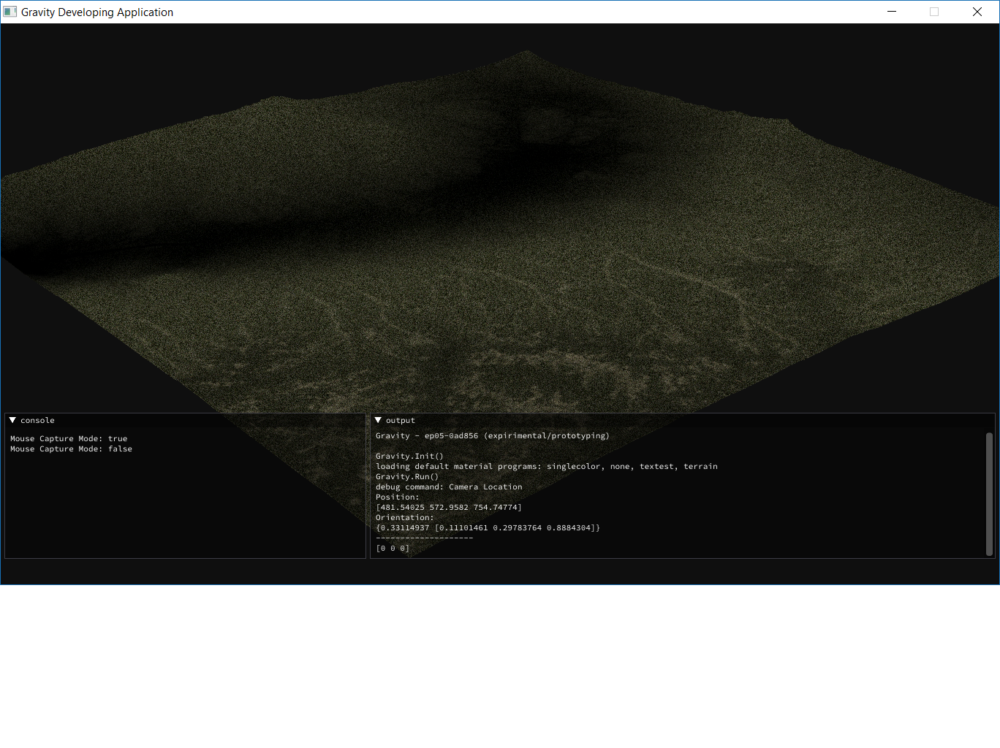

# Gravity
3D OpenGL engine for Go

## Building
Under the ```developing``` directory is the project code I use to test as I work on the engine itself. I keep it always buildable when commiting. To try it out, run the command ```gdt rundevapp``` or ```./gdt.bash rundevapp```


## Current Development

Summary: Terrain generated by World Machine loaded into engine. I am still working out exactly how to texture the terrain mesh correctly with the splat maps and height maps.


---


---


View more screenshots at [doc/progress.md](doc/progress.md)

## Next Development

Next on the todo list is bolting on a physics engine. Currently I have a prototype of bullet3 working well enough and if nothing changes, I plan to integrated bullet3 very soon.

On the horizon is to begin implementing a proper scene graph which will pave way for ECS implementation.


## Gravity Development Tools
For consistent tooling purposes across platforms all common Gravity development tooling is being put into ./developing/tools as go source files. You can run these tools by using ```go run ./developing/tools <command>```

Currently available GDT commands:  
   **apitrace**   -  trace full opengl state and opens qapitrace gui (requires apitrace)  
   **depgraph**   -  graphs package dependency relationships of Gravity (requires graphiz)  
   **genversion** -  generate the version.go source file for Gravity (requires git)
   **rundevapp**  -  go run's the developing/experimenting program under ./developing
